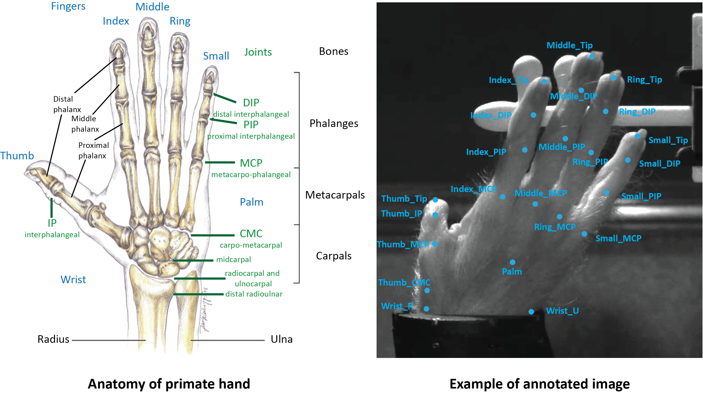

# hand_tracking
In Dr. Daniel O'Connor's lab, we are interested in haptic shape perception in primates. We use our hands to grasp, recognize, and manipulate objects. To understand how we perceive 3D shapes using tactile signals, it is critical to track how hands interact with objects. This repository is created for markerless 3D tracking of monkey hand from multiple camera views. It leverages the machine learning approach **Lightning Pose** / **DeepLabCut** to track keypoints in 2D and **Anipose** / **NCams** to estimate 3D pose. We then can apply musculoskeletal modeling (**OpenSim**). 

Notes:
- DeepLabCut and Lightning Pose are 2D CNNs. I'm exploring other 3D tracking tools that use 3D CNNs ([DANNCE](https://github.com/spoonsso/dannce)) or hybrid 2D/3D CNNs [JARVIS](https://github.com/JARVIS-MoCap/JARVIS-HybridNet). 

 
## Workflow
1. **Camera calibration** \
Both **Jarvis** and **Anipose** require camera calibration.See below sections and corresponding folders for detailed instructions. 

2. **Annotation** \
**Jarvis** provides a great annotation tool that leverages the multi camera recordings by projecting manual annotations on a subset of those cameras to the remaining ones, significantly reducing the amount of tedious manual annotations needed. \
Jarvis GitHub: https://github.com/JARVIS-MoCap/JARVIS-AnnotationTool

3. **Model training** \
**Lightning Pose** improves pose estimation through (1) unsupervised losses (2) temporal context network and (3) post hoc refinement (Kalman smoothing). \
Lightning Pose GitHub: https://github.com/danbider/lightning-pose \
Lightning Pose paper: https://www.nature.com/articles/s41592-024-02319-1

4. **Triangulation** \
Following camera calibration, **Anipose** can triangulate 2D outpupts from Lightning Pose and refine estimation using spatiotemporal filters. \
Anipose GitHub: https://github.com/lambdaloop/anipose \
Anipose paper: https://doi.org/10.1016/j.celrep.2021.109730

5. **Inverse kinematics** \
OpenSim is a platform for modeling humans, animals, robots, and the environment, and simulating their interaction and movement.   https://simtk.org/projects/opensim/

## Prerequisites
- **Software** \
  Please install the software listed in the workflow section.

- **Hardware**\
To study haptic shape perception from, experiments are designed to be conducted in the dark to minimize visual information of 3D objects. Therefore, in this study, infrared illuminators and cameras are used to capture images in the dark. 
  - Cameras:\
    FLIR Blackfly S3 cameras (4 [mono-color](https://www.edmundoptics.com/p/bfs-u3-23s3m-c-usb3-blackflyreg-s-monochrome-camera/41346/#) cameras with [25mm focal length lens](https://www.edmundoptics.com/p/25mm-uc-series-fixed-focal-length-lens/2971/) and 2 [color](https://www.edmundoptics.com/p/bfs-u3-23s3c-c-usb3-blackflyreg-s-color-camera/41347/) cameras with [12mm focal length lens](https://www.edmundoptics.com/p/12mm-uc-series-fixed-focal-length-lens/2969/)).\
    [Remove IR filters](https://www.flir.com/support-center/iis/machine-vision/knowledge-base/removing-the-ir-filter-from-a-color-camera/ ) if needed.
  - Illuminators:\
    [Edmundoptics IR Spot Lights](https://www.edmundoptics.com/f/advanced-illumination-long-working-distance-high-intensity-spot-lights/39791/) (940 nm)
  
## Camera Calibration
- **Calibration Videos**
  - Print a checker or charuco board. \
  See an example [6*8 charuco board](NCams/charuco_board_6x8.pdf).

  - For intrinsic calibration, take videos for individial cameras. 
  - For extrinsic calibration, take videos for all cameras (Anipose) or pairs of cameras (Jarvis).
  - Notes:
    - A charuco board is recommended. 
    - We can use `ncams.camera_tools.create_board` to create a checker or charuco board (see Step 2 in [Camera_calibration_pipeline](NCams/Camera_calibration_pipeline.ipynb)).
  
    - Try to cover several distances and all parts of views.
    - For checker board calibration, keep the orientation consistent. Do not roate the checker board more than 30 degrees.
    - More tips can be found [here](https://deeplabcut.github.io/DeepLabCut/docs/Overviewof3D.html). 

- **Camera Calibration**
\
Please see the instructions in the Jarvis and Anipose folders.

## Hand Anatomy 
 

## Video Recording
  - Cameras are set up to cover all key points of monkey hand, and each key point is viewed by at least 2 cameras.
  - Synchronize multiple cameras. (See [hardware-triggered cameras](https://github.com/williamsnider/nidaq))
  - Save videos from multiple hardware-triggered cameras(See [FLIR_multi_cam](https://github.com/williamsnider/FLIR_multi_cam))
  - Example videos from 6 camera views 

<video src="examples/2024-04-15_10-36-24_969748_resized10.mp4">

https://github.com/user-attachments/assets/614a34dc-d53f-47c3-9ada-10cccca0931f

  
  
  

