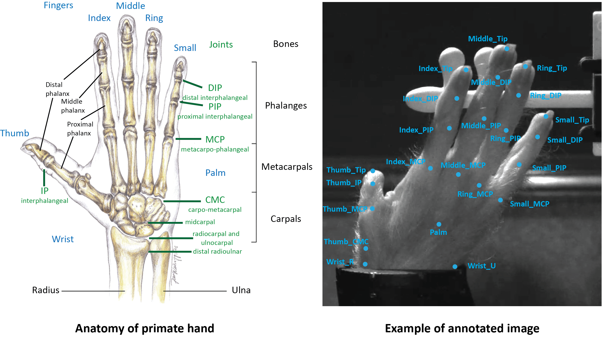

# hand_tracking

In Dr. Daniel O'Connor's lab, we are interested in haptic shape perception in primates. We use our hands to grasp, recognize, and manipulate objects. To understand how we perceive 3D shapes using tactile signals, it is critical to track how hands interact with objects. This repository is created for markerless 3D tracking of monkey hand from multiple camera views. It leverages the machine learning approach **Lightning Pose** to track keypoints in 2D and **Anipose** to estimate 3D pose. We then can apply musculoskeletal modeling (**OpenSim**).

---

## 1. Overview

| Stage | Tool | What it does |
|---|---|---|
| Camera calibration | JARVIS / Anipose | Intrinsic + extrinsic calibration from checker/ChArUco board videos |
| Annotation | JARVIS AnnotationTool | Multi-view-assisted manual keypoint labeling |
| Preprocessing | this repo | Converts JARVIS annotations → Lightning Pose format, builds calibration/config files |
| Training | Lightning Pose | Trains the 2D keypoint model (`litpose train`) |
| Inference | Lightning Pose | Predicts keypoints on new videos (`litpose predict`) |
| Triangulation | Anipose | Combines multi-view 2D predictions into 3D pose |
| Kinematics | this repo / OpenSim | Feature extraction and inverse kinematics |

Relevant tools:
- Lightning Pose GitHub: https://github.com/danbider/lightning-pose · Paper: https://www.nature.com/articles/s41592-024-02319-1
- Anipose GitHub: https://github.com/lambdaloop/anipose · Paper: https://doi.org/10.1016/j.celrep.2021.109730
- JARVIS AnnotationTool GitHub: https://github.com/JARVIS-MoCap/JARVIS-AnnotationTool
- OpenSim: https://simtk.org/projects/opensim/

---

## 2. Installation

### 2.1 Clone this repo

```bash
git clone https://github.com/YitingChang/hand_tracking.git
cd hand_tracking
```

### 2.2 `hand-trk` environment (preprocessing / kinematics)

This is the general-purpose environment used for preprocessing and kinematics steps, built from the included `environment.yml`.

```bash
conda env create -f environment.yml
conda activate hand-trk
```

### 2.3 Lightning Pose environment (`lp`) — training & inference

```bash
conda create -n lp python=3.12
conda activate lp
pip install lightning-pose lightning-pose-app
```

If you plan to edit Lightning Pose's core code instead of just using it, install it as an editable clone instead:

```bash
git clone https://github.com/danbider/lightning-pose.git
cd lightning-pose
pip install -e ".[dev]"
```

Lightning Pose requires a Linux/WSL environment with an NVIDIA GPU.

### 2.4 Anipose environment — triangulation

```bash
conda create -n anipose python=3.10
conda activate anipose
pip install anipose
# on Linux, mayavi + ffmpeg are needed for the 3D viewer:
conda install mayavi ffmpeg
pip install --upgrade apptools
```

> If you hit an OpenCV conflict, remove `opencv-python` first so `opencv-contrib-python` installs cleanly: `pip uninstall opencv-python`.

### 2.5 JARVIS AnnotationTool — annotation & calibration

The AnnotationTool is a desktop app, not a Python package. Easiest path is to grab a prebuilt installer:

- Downloads page: https://jarvis-mocap.github.io/jarvis-docs/downloads/downloads/
- Supported OS: Windows, macOS, Ubuntu 20.04/18.04 (build from source for other Linux distros — instructions in the [JARVIS-AnnotationTool repo](https://github.com/JARVIS-MoCap/JARVIS-AnnotationTool))

### 2.6 Update the environment paths in `pipeline.py`

`src/hand_tracker/pipeline.py` hardcodes the data locations and conda environment paths for each stage — update these to match your machine before running anything:

```python
RAW_DATA_ROOT = Path("/media/.../Data/Videos")
ANALYSIS_ROOT = Path("/media/.../Analysis")
LP_ROOT       = Path("/home/.../lightning-pose")

ENV_PATHS = {
    "preprocessing": "/path/to/anaconda3/envs/hand-trk/bin/python",
    "training":      "/path/to/anaconda3/envs/lp/bin/python",
    "inference":     "/path/to/anaconda3/envs/lp/bin/python",
    "triangulation": "/path/to/anaconda3/envs/anipose/bin/python",
    "kinematics":    "/path/to/anaconda3/envs/hand-trk/bin/python",
}
```

---

## 3. Hardware Setup

Experiments are conducted in the dark (to remove visual cues during haptic-only tasks), so recording uses IR illumination:

- **Cameras:** FLIR Blackfly S3 — 4 [monochrome](https://www.edmundoptics.com/p/bfs-u3-23s3m-c-usb3-blackflyreg-s-monochrome-camera/41346/#) cameras with [25 mm lens](https://www.edmundoptics.com/p/25mm-uc-series-fixed-focal-length-lens/2971/) + 2 [color](https://www.edmundoptics.com/p/bfs-u3-23s3c-c-usb3-blackflyreg-s-color-camera/41347/) cameras with [12 mm lens](https://www.edmundoptics.com/p/12mm-uc-series-fixed-focal-length-lens/2969/). [Remove IR filters](https://www.flir.com/support-center/iis/machine-vision/knowledge-base/removing-the-ir-filter-from-a-color-camera/) from color cameras if needed.
- **Illumination:** [Edmund Optics IR spot lights](https://www.edmundoptics.com/f/advanced-illumination-long-working-distance-high-intensity-spot-lights/39791/) (940 nm).
- **Synchronization:** hardware-triggered multi-camera recording — see [nidaq](https://github.com/williamsnider/nidaq) and [FLIR_multi_cam](https://github.com/williamsnider/FLIR_multi_cam).

---

## 4. Camera Calibration

1. Print a checker or ChArUco board (example: [6x8 ChArUco board](NCams/charuco_board_6x8.pdf)), or generate one with `ncams.camera_tools.create_board` (see Step 2 of `NCams/Camera_calibration_pipeline.ipynb`).
2. **Intrinsic calibration:** record each camera individually.
3. **Extrinsic calibration:** record all cameras together (Anipose) or in pairs (JARVIS).
4. Tips:
   - ChArUco boards are preferred over plain checkerboards.
   - Cover multiple distances and all parts of the camera views.
   - For checkerboard calibration, don't rotate the board more than 30°.
   - See detailed instructions in the `Jarvis/` and `Anipose/` folders of this repo, plus [DeepLabCut's 3D calibration overview](https://deeplabcut.github.io/DeepLabCut/docs/Overviewof3D.html).

---

## 5. Annotation (JARVIS)

JARVIS's AnnotationTool leverages multi-camera recordings by projecting manual annotations on a subset of cameras to the remaining ones, significantly reducing the amount of manual annotation needed.

**Create a new annotation dataset**
- Open the AnnotationTool → add your synchronized recordings → define Entities and Keypoints (or load the "Hand" preset) → Create.

**Update an existing annotation dataset**
1. Copy the existing annotation dataset (keep the original as backup).
2. Run `src/hand_tracker/annotation/batch_add_keypoint.py` to add new keypoints in bulk.
3. Update the dataset's configuration `.yaml` to reflect the new keypoint list.

### Hand Anatomy


---

## 6. Model Training (Lightning Pose)

Lightning Pose has two different model options: single-view and multi-view. In this pipeline, we implemeted the multi-view version to leverage multiview transformers and patch masking for robust 3D tracking. In addition, we include post hoc refinement (Kalman smoothing).

### 6.1 Preprocessing

1. **Incorporate multiple calibrations** — add Anipose calibration results into the JARVIS annotations folders, or convert JARVIS calibration to Anipose/Lightning Pose format (conversion script not yet implemented).
   - Script: `src/hand_tracker/preprocessing/jarvis2lp.py`
2. **Prepare Lightning Pose training data:**
   - Transform JARVIS annotations → Lightning Pose format
   - Verify video compatibility and file naming
   - Extract frames for temporal context, if needed
   - Create calibration files from the Anipose calibration (required for multi-view models)
3. Create `project.yaml`
4. Edit `config.yaml`

```bash
conda activate hand-trk
python src/hand_tracker/pipeline.py --stage preprocess --session 2025-12-16
```

### 6.2 Training

1. Create a training config, e.g. `lightning-pose/scripts/configs/config_multiview_cal.yaml`.
2. Train:

```bash
conda activate lp
litpose train /path/to/lp/repo/lightning-pose/scripts/configs/config_multiview_cal.yaml
```

3. Monitor training metrics:

```bash
tensorboard --logdir outputs/YYYY-MM-DD/
```

4. Check pixel error (train/validation) using `src/hand_tracker/modeling/litpose_model_pixel_error.ipynb`.

---

## 7. Inference Pipeline

### 7.1 Prepare configuration files

- `~/Analysis/<session>/litpose/config.yaml` — update the `eval` section:
  - model path
  - video folder
  - confidence threshold
- `~/Analysis/<session>/anipose/config.toml` — update the calibration folder path.

### 7.2 Run the pipeline

All stage commands below are run from inside `hand_tracking_project/`:

```bash
# Preprocessing
python src/hand_tracker/pipeline.py --stage preprocess --session 2025-12-16

# Inference (2D keypoints, Lightning Pose)
python src/hand_tracker/pipeline.py --stage inference --session 2025-12-16

# Triangulation (2D -> 3D, Anipose)
python src/hand_tracker/pipeline.py --stage triangulate --session 2025-12-16

# Kinematics (feature extraction / inverse kinematics)
python src/hand_tracker/pipeline.py --stage kinematics --session 2025-12-16
```

You can also run every stage in sequence for a session:

```bash
python src/hand_tracker/pipeline.py --stage all --session 2025-12-16
```

Each stage automatically runs in its own conda environment (as configured in `ENV_PATHS`), so there's no need to manually activate an environment before calling `pipeline.py`.

---

## 8. Video Recording

- Cameras are set up to cover all key points of the monkey hand, with each keypoint viewed by at least 2 cameras.
- Synchronize multiple cameras — see [hardware-triggered cameras](https://github.com/williamsnider/nidaq).
- Save videos from multiple hardware-triggered cameras — see [FLIR_multi_cam](https://github.com/williamsnider/FLIR_multi_cam).

---

## 9. Notes / Roadmap

- Currently uses **Lightning Pose** (2D CNNs) + **Anipose**(3D triangulation). Exploring 3D and hybrid 2D/3D CNN alternatives: [DANNCE](https://github.com/spoonsso/dannce), [JARVIS-HybridNet](https://github.com/JARVIS-MoCap/JARVIS-HybridNet).
- Lightning Pose team is actively developing the full 3d tracking pipeline. We can consider to switch to it. 
- JARVIS → Anipose/Lightning Pose calibration conversion is not yet implemented (currently working around this by adding Anipose calibration directly into the JARVIS annotations folder).
- This repo contains scripts to use the Ensemble Kalman Smoother (EKS) (Github: https://github.com/paninski-lab/eks). However, it is not implmented in the pipeline itself. 
